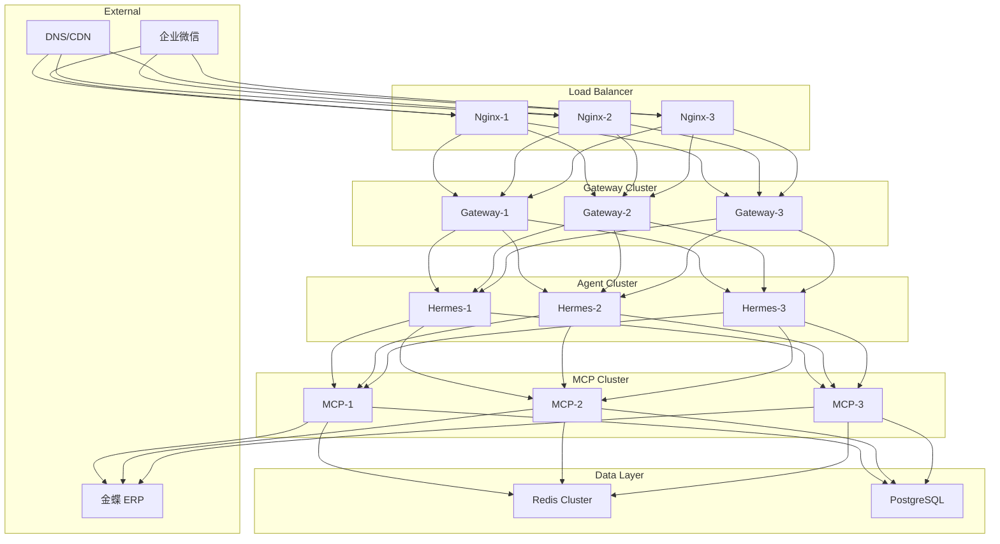

# 高可用部署方案设计

## 概述

本文档描述 Hermes Work Assistant 的高可用部署架构，确保服务在故障时能够快速恢复。

## 设计目标

1. **可用性目标**: 99.9% (年故障时间 < 8.76 小时)
2. **故障恢复**: RTO < 5 分钟, RPO < 1 分钟
3. **无单点故障**: 所有组件均可横向扩展
4. **自动故障转移**: 无需人工干预

## 架构设计

### 整体架构图

```
                           ┌─────────────────┐
                           │   DNS / CDN     │
                           │  (负载均衡入口)  │
                           └────────┬────────┘
                                    │
                    ┌───────────────┼───────────────┐
                    │               │               │
                    ▼               ▼               ▼
            ┌─────────────┐ ┌─────────────┐ ┌─────────────┐
            │   nginx-1   │ │   nginx-2   │ │   nginx-3   │
            │  (反向代理)  │ │  (反向代理)  │ │  (反向代理)  │
            └──────┬──────┘ └──────┬──────┘ └──────┬──────┘
                   │               │               │
                   └───────────────┼───────────────┘
                                   │
                    ┌──────────────┼──────────────┐
                    │              │              │
                    ▼              ▼              ▼
            ┌───────────┐  ┌───────────┐  ┌───────────┐
            │ Gateway-1 │  │ Gateway-2 │  │ Gateway-3 │
            │(企微网关) │  │(企微网关) │  │(企微网关) │
            └─────┬─────┘  └─────┬─────┘  └─────┬─────┘
                  │              │              │
                  └──────────────┼──────────────┘
                                 │
                    ┌────────────┼────────────┐
                    │            │            │
                    ▼            ▼            ▼
            ┌───────────┐ ┌───────────┐ ┌───────────┐
            │ Hermes-1  │ │ Hermes-2  │ │ Hermes-3  │
            │(Agent服务)│ │(Agent服务)│ │(Agent服务)│
            └─────┬─────┘ └─────┬─────┘ └─────┬─────┘
                  │             │             │
                  └─────────────┼─────────────┘
                                │
                    ┌───────────┼───────────┐
                    │           │           │
                    ▼           ▼           ▼
            ┌───────────┐ ┌───────────┐ ┌───────────┐
            │  MCP-1    │ │  MCP-2    │ │  MCP-3    │
            │(ERP工具)  │ │(ERP工具)  │ │(ERP工具)  │
            └─────┬─────┘ └─────┬─────┘ └─────┬─────┘
                  │             │             │
                  └─────────────┼─────────────┘
                                │
                                ▼
                        ┌───────────────┐
                        │     Redis     │
                        │   (共享缓存)   │
                        └───────┬───────┘
                                │
                                ▼
                        ┌───────────────┐
                        │   PostgreSQL  │
                        │  (持久化存储)  │
                        └───────┬───────┘
                                │
                                ▼
                        ┌───────────────┐
                        │   金蝶 ERP     │
                        │  (外部系统)    │
                        └───────────────┘
```

### MCP Server 多实例部署

```yaml
# docker-compose.yml (生产环境)
services:
  kingdee-mcp-server:
    image: hermes-mcp-server:latest
    deploy:
      replicas: 3  # 3 个实例
      resources:
        limits:
          cpus: '1'
          memory: 512M
        reservations:
          cpus: '0.5'
          memory: 256M
      restart_policy:
        condition: on-failure
        delay: 5s
        max_attempts: 3
    healthcheck:
      test: ["CMD", "curl", "-f", "http://localhost:8080/health"]
      interval: 30s
      timeout: 10s
      retries: 3
      start_period: 40s
    environment:
      - REDIS_URL=redis:6379  # 共享 Redis 缓存
      - CACHE_ENABLED=true
    networks:
      - hermes-internal
```

### 负载均衡策略

#### 1. Nginx 配置

```nginx
# nginx/nginx.conf
upstream hermes_gateway {
    least_conn;  # 最少连接数策略
    server gateway-1:8001 weight=3;
    server gateway-2:8001 weight=3;
    server gateway-3:8001 weight=3;
    keepalive 32;  # 保持连接池
}

upstream hermes_mcp {
    least_conn;
    server mcp-1:8080 weight=3;
    server mcp-2:8080 weight=3;
    server mcp-3:8080 weight=3;
    keepalive 16;
}

server {
    listen 80;
    
    location /gateway/ {
        proxy_pass http://hermes_gateway/;
        proxy_http_version 1.1;
        proxy_set_header Connection "";
        proxy_connect_timeout 5s;
        proxy_read_timeout 30s;
    }
    
    location /mcp/ {
        proxy_pass http://hermes_mcp/;
        proxy_http_version 1.1;
        proxy_set_header Connection "";
    }
}
```

#### 2. 健康检查策略

```yaml
# 健康检查配置
health_check:
  endpoint: /health
  interval: 30s
  timeout: 10s
  unhealthy_threshold: 3  # 连续 3 次失败标记为不健康
  healthy_threshold: 2    # 连续 2 次成功标记为健康
```

### 故障恢复机制

#### 1. 自动重启

```yaml
# Docker Swarm / Kubernetes 配置
restart_policy:
  condition: on-failure
  delay: 5s
  window: 1m
  max_attempts: 3
```

#### 2. 会话状态恢复

```python
# 会话状态存储在 Redis
class SessionManager:
    def save_session(self, session_id: str, state: dict):
        # 存储到 Redis，确保故障恢复后可继续
        redis.set(f"session:{session_id}", json.dumps(state), ex=3600)
    
    def restore_session(self, session_id: str) -> dict:
        data = redis.get(f"session:{session_id}")
        return json.loads(data) if data else None
```

#### 3. 消息队列保障

```
用户消息 → WeChat Gateway → RabbitMQ → Hermes Agent
                              ↑
                        消息持久化，故障恢复后继续处理
```

### 监控与告警

#### Prometheus 监控指标

```yaml
# 关键监控指标
metrics:
  - service_health_status      # 服务健康状态
  - request_latency_p95        # P95 延迟
  - request_error_rate         # 错误率
  - instance_count             # 实例数量
  - cache_hit_rate             # 缓存命中率
  - connection_pool_usage      # 连接池使用率
```

#### 告警规则

```yaml
# prometheus/alert_rules.yml
groups:
  - name: hermes_alerts
    rules:
      - alert: ServiceDown
        expr: up{job="hermes_mcp"} == 0
        for: 1m
        labels:
          severity: critical
        annotations:
          summary: "MCP Server 实例宕机"
      
      - alert: HighErrorRate
        expr: rate(erp_error_count[5m]) > 0.1
        for: 2m
        labels:
          severity: warning
        annotations:
          summary: "ERP 操作错误率过高"
      
      - alert: HighLatency
        expr: histogram_quantile(0.95, rate(erp_query_latency_seconds_bucket[5m])) > 5
        for: 2m
        labels:
          severity: warning
        annotations:
          summary: "P95 延迟超过 5 秒"
```

### 部署架构图 (Mermaid)



## 实施步骤

### Phase 1: 基础 HA (Week 1)
- [ ] 多实例部署配置
- [ ] 负载均衡配置
- [ ] 健康检查实现

### Phase 2: 状态管理 (Week 2)
- [ ] Redis 共享缓存
- [ ] 会话状态持久化
- [ ] 消息队列集成

### Phase 3: 监控告警 (Week 3)
- [ ] Prometheus 监控
- [ ] Grafana Dashboard
- [ ] 告警规则配置

## 验收标准

| 标准 | 验证方法 |
|------|----------|
| 99.9% 可用性 | 监控系统统计 |
| RTO < 5min | 故障模拟测试 |
| 无单点故障 | 组件故障测试 |
| 自动故障转移 | 实例宕机测试 |

## 灾难恢复

### 备份策略

```bash
# 每日备份脚本
#!/bin/bash
# 备份 Redis 数据
redis-cli BGSAVE
cp /var/lib/redis/dump.rdb /backup/redis-$(date +%Y%m%d).rdb

# 备份 PostgreSQL
pg_dump hermes_db > /backup/pg-$(date +%Y%m%d).sql

# 备份审计日志
tar -czf /backup/audit-$(date +%Y%m%d).tar.gz /app/data/audit/
```

### 恢复流程

```bash
# 1. 恢复 Redis
redis-cli FLUSHALL
redis-cli RESTORE /backup/redis-20240101.rdb

# 2. 恢复 PostgreSQL
psql hermes_db < /backup/pg-20240101.sql

# 3. 恢复审计日志
tar -xzf /backup/audit-20240101.tar.gz -C /app/data/

# 4. 重启服务
docker-compose restart
```